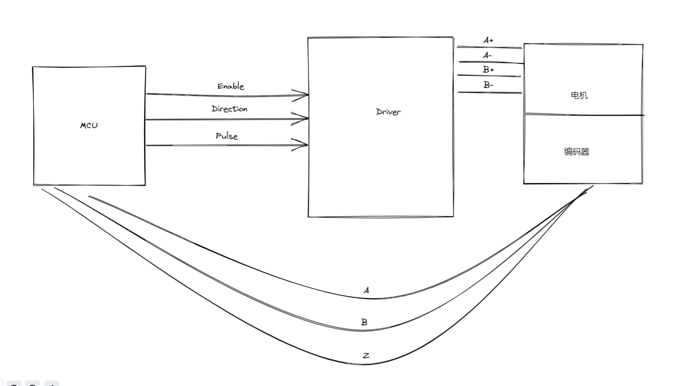

# StepMotor

帮助朋友完成步进电机控制酸性气体容纳设备升降的项目。

## 1.功能需求

1. 两个按键控制升降
2. 一个步进电机的上升和下降
3. 2.软件限位
   
   ## 2 实现方案
   
   ### 2.1 两个按键控制升降
   
   使用**按键中断**的方式输出按键控制的逻辑量；
   
   ### 2.2 一个步进电机的上升和下降
4. 定时器输出PWM脉冲方波
5. 定时器的定时功能
6. 实现PID控制器对步进电机进行闭环控制

## 2.1 进度追踪

2022年9月28日11:55:06

工程搭建：重新更换核心板

控制框图绘制：

